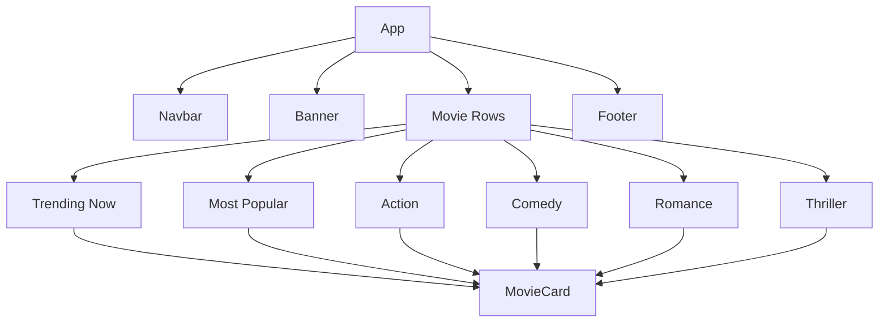
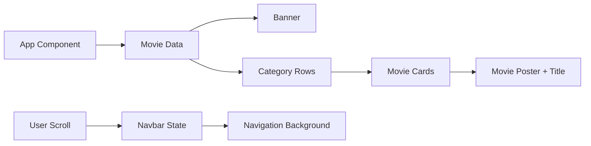

# 🎬 StreamFlix

A Netflix-inspired movie streaming interface built with React.js, featuring a cinematic hero banner, categorized movie collections, reusable components, and a responsive dark-themed viewing experience.

━━━━━━━━━━━━━━━━━━━━━━━━━━━━━━━━━━

## ✨ Overview

StreamFlix recreates the core visual experience of a modern streaming platform through a component-based React application.

The interface organizes movies into multiple categories and presents them through reusable horizontal rows, while a dynamic navigation bar and hero banner create a familiar streaming-platform experience.

━━━━━━━━━━━━━━━━━━━━━━━━━━━━━━━━━━

## 🚀 Features

| Feature                 | Description                                                              |
| ----------------------- | ------------------------------------------------------------------------ |
| 🎬 Hero Banner          | Large featured movie section with title, description, and action buttons |
| 🔥 Trending Movies      | Displays currently trending movie selections                             |
| ⭐ Most Popular          | Dedicated section for popular movies                                     |
| 💥 Action               | Action movie collection                                                  |
| 😂 Comedy               | Comedy movie collection                                                  |
| ❤️ Romance              | Romance movie collection                                                 |
| 🔪 Thriller             | Thriller movie collection                                                |
| 🧩 Reusable Components  | Modular Navbar, Banner, Row, MovieCard, and Footer components            |
| 📱 Responsive Interface | Layout designed for different screen sizes                               |
| 🖼️ Local Movie Assets  | Movie posters are stored locally within the project                      |
| 🎨 Streaming-Style UI   | Dark theme, gradients, hover effects, and cinematic layout               |
| 📜 Scroll-Based Navbar  | Navigation background changes after scrolling                            |

━━━━━━━━━━━━━━━━━━━━━━━━━━━━━━━━━━

## 🛠️ Tech Stack

| Technology      | Purpose                              |
| --------------- | ------------------------------------ |
| React.js        | Component-based frontend development |
| JavaScript ES6+ | Application logic and interactivity  |
| CSS3            | Styling and visual presentation      |
| Flexbox / Grid  | Layout and responsive design         |
| React Hooks     | Scroll-based navbar state management |
| Local Assets    | Movie poster and visual content      |

━━━━━━━━━━━━━━━━━━━━━━━━━━━━━━━━━━

## 🧩 Component Architecture



━━━━━━━━━━━━━━━━━━━━━━━━━━━━━━━━━━

## 📁 Project Structure

```text
streamflix-main/
│
├── App.js
├── App.css
├── index.js
├── index.css
│
├── components/
│   ├── Navbar.js
│   ├── Navbar.css
│   ├── Banner.js
│   ├── Banner.css
│   ├── Row.js
│   ├── Row.css
│   ├── MovieCard.js
│   ├── MovieCard.css
│   ├── Footer.js
│   └── Footer.css
│
├── images/
│   ├── breakingbad.jpeg
│   ├── stranger.png
│   ├── moneyheist.jpeg
│   ├── peakyblinders.jpeg
│   └── ...
│
└── public/
    ├── index.html
    ├── favicon.ico
    ├── manifest.json
    └── robots.txt
```

━━━━━━━━━━━━━━━━━━━━━━━━━━━━━━━━━━

## 🔄 Application Flow



━━━━━━━━━━━━━━━━━━━━━━━━━━━━━━━━━━

## 💡 Key Implementation Concepts

### 🔹 Component-Based Architecture

The application is divided into reusable React components such as:

• Navbar
• Banner
• Row
• MovieCard
• Footer

This keeps the UI modular and easier to maintain.

### 🔹 Dynamic Movie Rows

Movie collections are passed to the reusable `Row` component.

Different categories are rendered using the same component structure rather than creating separate components for every category.

### 🔹 Reusable Movie Cards

`MovieCard` receives movie information through props and dynamically renders the movie poster and title.

### 🔹 Scroll-Based Navigation

The Navbar uses React's `useState` and `useEffect` hooks to monitor the user's scroll position.

When the page is scrolled beyond the defined threshold, the navigation bar receives a different styling state.

### 🔹 Dynamic Banner

The Banner component receives movie information through props and displays:

• Movie title
• Description
• Play button
• My List button

The description is truncated before being displayed to keep the hero section visually clean.

### 🔹 Local Movie Data

Movie posters are included as local project assets, allowing the interface to display the movie catalogue without requiring an external movie database for the displayed content.

━━━━━━━━━━━━━━━━━━━━━━━━━━━━━━━━━━

## 🎯 What This Project Demonstrates

StreamFlix demonstrates practical experience with:

• React.js component architecture
• Props and reusable components
• React Hooks
• State management
• Event handling
• Dynamic rendering with `.map()`
• Conditional styling
• CSS-based responsive layouts
• Local asset management
• UI/UX implementation
• Modular frontend development

━━━━━━━━━━━━━━━━━━━━━━━━━━━━━━━━━━

